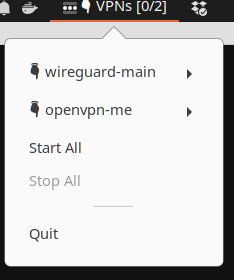

# servicetray

Configurable system tray widget for a group of related services



## Installation

servicetray is a go app. It's built with [https://github.com/getlantern/systray](systray) - see that repo for installation requirements

## Usage

Create a config file called `servicetray.yml`, before running `servicetray`

### Simple example

```
title: VPNs
items:
   - name: wireguard-am
     start:
       cmd: systemctl
       args: [start,wg-quick@am]
     stop:
       cmd: systemctl
       args: [stop,wg-quick@am]
     check:
       cmd: systemctl
       args: [status,wg-quick@am]
```

### Other examples

Typically you'd group multiple similar items together.

This example uses a 'template' for managing multiple vpns, via systemctl ...

```
title: VPNs
icon: /usr/share/icons/gnome/16x16/emblems/emblem-system.png
items:
   - name: wireguard-am
     template: systemctl
     vars:
       svc: wg-quick@am
   - name: openvpn-amir
     template: systemctl
     vars:
       svc: openvpn@am
   - name: openvpn-other
     template: systemctl
     vars:
       svc: openvpn@other
templates:
   - name: systemctl
     start:
       cmd: systemctl
       args: [start,"{{.svc}}"]
     stop:
       cmd: systemctl
       args: [stop,"{{.svc}}"]
     check:
       cmd: systemctl
       args: [status,"{{.svc}}"]
```


### Generators

This example uses docker-compose to dynamically generate a list of services at startup

```
title: portal
icon: /usr/share/icons/docker/16x16/docker.png
pwd: /home/am/my-dockercompose-project
generators:
  - name: portal-compose
    find:
      cmd: docker-compose
      args: [ps,--services]
    template: docker-compose
templates:
  - name: docker-compose
    start:
      cmd: docker-compose
      args: [up,-d,"{{.svc}}"]
    stop:
      cmd: docker-compose
      args: [stop,"{{.svc}}"]
    check:
      cmd: /home/am/my-dockercompose-project/dcrunning.sh
      args: ["{{.svc}}"]
```

Note: docker-compose isn't the easiest for checking status, so this recipe uses a shell script ... dcrunning.sh looks like this:

```
#!/bin/bash

export id=$(docker-compose ps -q $1)
if [ "$id" == "" ]; then
	exit 1;
fi
docker ps -q --no-trunc| grep -q $id
```
